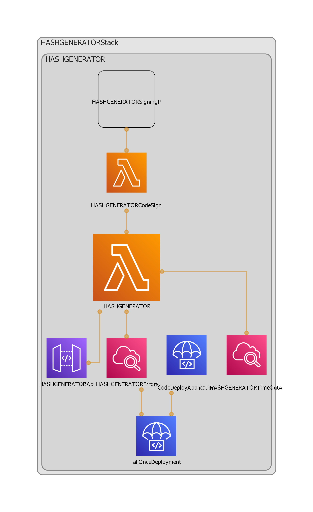

# IaC Hash generator python

## ¿Que es? 
Este repositorio es una implementacion de un microservicio serverless con el uso del [AWS CDK (Cloud Development Kit)](https://aws.amazon.com/cdk/) donde se usan los servicios de: 
* Lambda
* Apigateway
* CodeDeploy
* CloudWatch errors

el microservicio esta realizado con python y se usa la libreria de flas-serverless para el correcto funcionamiento en las invocaciones de lambda

## ¿Como Usar?
Para poder usar y desplegar este codigo, se necesita hacer una serie de pasos descritos a continuacion.

### Utilizar perfil de amazon en AWS CLI
PAra poder desplegar el codigo y usarlo, se necesita tener instalado el [CLI de AWS](https://aws.amazon.com/cli/) y haber configurado un perfil con las llaves proporcionadas por IAM para mas informacion visitar [documentacion de aws](https://aws.amazon.com/premiumsupport/knowledge-center/create-access-key/)

### Cambiar archivo de configuraciones
En el archivo project_configs/environment_options.yaml cambiar **region y numero** de cuenta de AWS

```
  account: "{{NUMERO DE CUENTA}}"
  region: "us-east-1"
```

despues revisar las opciones de lambda dentro del mismo archivo.

### Sintetizar codigo CDK

Despues de hacer las configuraciones lo siguente es ver que nuestro codigo sintetiza a una platilla de cloudformation de manera limpia para hacer esto es necesrio tener instalado CDK desde npm 

``` npm i -g @aws-cdk ```
una vez instalado podemos correr el comando de CDK para sintetizar el codigo

``` cdk synth ```

si todo esta correcto en la consola deberia imprimir el resultado de la platilla de cloudformation.

### Despligue
El ultimo paso es desplegar nuestro stack de servicios
``` cdk deploy --profile "{NOMBRE_DE_PERFIL_AWS_CLI}"```


## Diagrama de arquitectura


